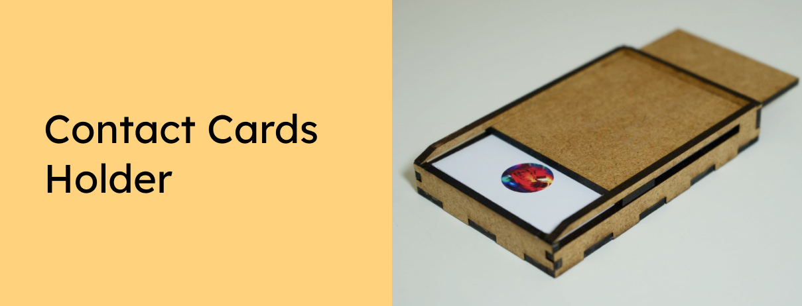

Want to store your contact/business cards in a unique case? Just download this card holder and lasercut it yourself!

Want to support the development and stay updated?

 

## Instrutions
Lasercut the contactcards_holder.plf or the files inside the "lasercutter files" folder on 3mm thick MDF plates - and connect them like in the 3D model here + glue them together: [https://www.tinkercad.com/things/c4U76DiQ6Cv](https://www.tinkercad.com/things/c4U76DiQ6Cv)